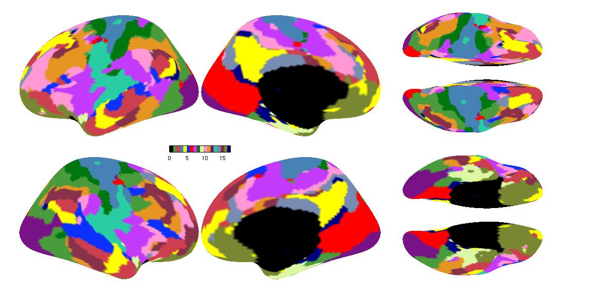
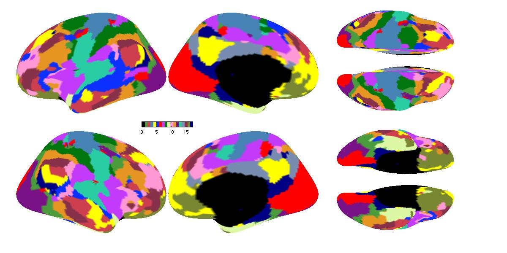

# Examples of Multi-session hierarchical Bayesian model (MS-HBM)

The examples of MS-HBM contain three tasks:
1. Generating profiles and estimating initialization parameters
   - CoRR-HNU data in fsaverage5 surface space: 2 subjects, each subject has 2 sessions, each subject has 1 run
2. The group priors estimation on example data:
   - CoRR-HNU data in fsaverage5 surface space: 2 subjects, each subject has 2 sessions
3. The individual-level parcellation generation on example data:
   - CoRR-HNU data in fsaverage5 surface space: 2 subjects, each subject has 2 sessions
   
Note that for simplicity, the example data of task 1 and task 2 are the same. However, the initialization parameters estimated in task 1 **won't** be used in task 2, the group priors estimated in task 2 **won't** be used in task 3. We will use the initialization parameters and group priors pre-computed by using GSP dataset (37 subjects, 2 sessions). 

----

References
==========
+ Kong R, Li J, Orban C, et al. [Spatial Topography of Individual-Specific Cortical Networks Predicts Human Cognition, Personality, and Emotion](https://academic.oup.com/cercor/advance-article/doi/10.1093/cercor/bhy123/5033556?guestAccessKey=2fa23bc8-59c7-4ff1-9360-1846d472c6dd). Cerebral Cortex. 2018.

----

Data
====
In this example, we will perform the algorithms on the functional connectivity profiles of CoRR-HNU datasets:
+ **CoRR-HNU:**
  
  `$CBIG_CODE_DIR/data/example_data/CoRR_HNU/subj0?/subj0?_sess?`

----

Run
====

### Generating input data
----

In the terminal, specify the output directory and call the example data generation script:
```
$CBIG_CODE_DIR/stable_projects/brain_parcellation/Kong2019_MSHBM/examples/CBIG_MSHBM_create_example_input_data.sh <output_dir>
```
Note that in your `<output_dir>`, there will be three folders:
+ `<output_dir>/generate_profiles_and_ini_params`
+ `<output_dir>/estimate_group_priors`
+ `<output_dir>/generate_individual_parcellations`

We will then provide examples for each task separately.

### Generating profiles and initialization parameters
----

After **Generating input data**,

the `data_list` folder under `<output_dir>/generate_profiles_and_ini_params`:

+ `<output_dir>/generate_profiles_and_ini_params/data_list/fMRI_list/?h_sub?_sess?.txt`

contains the left and right hemisphere fMRI data in `fsaverage5` for each subject and each session. Note that our example data only has 1 run for each session, if there are multiple runs, then the corresponding `?h_sub?_sess?.txt` should have multiple columns, where each column corresponds to each run, the columns should be separated by white space.

+ `<output_dir>/generate_profiles_and_ini_params/data_list/censor_list/sub?_sess?.txt`

contains the censor lists for each subject and each session. The outlier frames will be denoted as 0s. Again, if there are multiple runs, `sub?_sess?.txt` should have multiple columns. Furthermore, if the user don't want to mask out the outliers in computing profiles, just leave the `censor_list` folder empty.

In the terminal:
```
cd $CBIG_CODE_DIR/stable_projects/brain_parcellation/Kong2019_MSHBM/step1_generate_profiles_and_ini_params
```

Start Matlab, in Matlab command window, run the following commands to generate profiles for each session of the 2 subjects, the fMRI data are in `fsaverage5`, the ROIs are defined by `fsaverage3`.

```
project_dir = '<output_dir>/generate_profiles_and_ini_params';
for sub = 1:2
 for sess = 1:2
	CBIG_MSHBM_generate_profiles('fsaverage3','fsaverage5',project_dir,num2str(sub),num2str(sess),'0');
 end
end
```
The profiles will be saved into `profiles` folder:

+ `<output_dir>/generate_profiles_and_ini_params/profiles/sub?/sess?/?h.sub?_sess?_fsaverage5_roifsaverage3.surf2surf_profile.nii.gz`


In practice, if the user only has 1 session and would like to apply it on MSHBM, the user need to split the session into two sub-sessions to make MSHBM work. To do that, run the following commands to split the first session of the 2 CoRR-HNU subjects and generate 2 profiles for each sub-session.

```
project_dir = '<output_dir>/generate_profiles_and_ini_params';
for sub = 1:2
 CBIG_MSHBM_generate_profiles('fsaverage3','fsaverage5',project_dir,num2str(sub),'1','1');
end
```
The profiles will be saved into `profiles` folder:

+ `<output_dir>/generate_profiles_and_ini_params/profiles/sub?/sess?/?h.sub?_sess?_fsaverage5_roifsaverage3.surf2surf_profile_1.nii.gz`

+ `<output_dir>/generate_profiles_and_ini_params/profiles/sub?/sess?/?h.sub?_sess?_fsaverage5_roifsaverage3.surf2surf_profile_2.nii.gz`

To generate the initialization parameters, we will apply Yeo2011 clustering algorithm on group averaged profiles. Run the following command to generate averaged profiles across 2 CoRR-HNU subjects with 2 sessions. Note that the profiles of split sub-sessions will be ignored. In practice, if the subject has different number of sessions, please set the `num_sess` to be the maximum number of sessions.

```
project_dir = '<output_dir>/generate_profiles_and_ini_params';
num_sub = '2';
num_sess = '2';
CBIG_MSHBM_avg_profiles('fsaverage3','fsaverage5',project_dir,num_sub,num_sess);
```

The results will be saved into `profiles/avg_profile` folder:

+ `<output_dir>/generate_profiles_and_ini_params/profiles/avg_profile/?h_fsaverage5_roifsaverage3_avg_profile.nii.gz`

We will then apply Yeo2011 clustering algorithm on above averaged profiles to generate the initialization parameters with 17 networks and 2 random initialization:

```
project_dir = '<output_dir>/generate_profiles_and_ini_params';
num_clusters = '17';
num_initialization = '2';
CBIG_MSHBM_generate_ini_params('fsaverage3','fsaverage5',num_clusters,num_initialization, project_dir)
```

The results will be saved into `group` folder:

+ `<output_dir>/generate_profiles_and_ini_params/group/group.mat`

contains the estimated initialization parameter `clustered.mtc`, which is the group-level functional connectivity profile of networks. `group.mat` also contains the estimated group-level parcellation `lh_labels` and `rh_labels`. The visualization of group-level parcellation is:


Note that there are only 2 random initializations and averaged profiles of 2 subjects in this example, so the clustering results are not optimal. In practice, we suggest the user to at least run 1000 random initializations. Please also note that we **will not** use the results generated in this step in the following sections.

### Group priors estimation
----

Note that the functional connectivity profiles and the initialization parameters from the Yeo2011 group clustering are already generated. There is no need to re-generate the profiles. 

After **Generating input data**,

the `group` folder under `<output_dir>/estimate_group_priors`:
+ `<output_dir>/estimate_group_priors/group/group.mat`

contains the **pre-computed** initialization parameters from group-level 17-network clustering generated by Yeo et al., 2011.

The `profile_list/training_set` folder `<output_dir>/estimate_group_priors`:
+ `<output_dir>/estimate_group_priors/profile_list/training_set/lh_sess?.txt`
+ `<output_dir>/estimate_group_priors/profile_list/training_set/rh_sess?.txt`

contain functional connectivity profiles of 37 GSP subjects with 2 sessions. These files are also **pre-generated**.

In the terminal:
```
cd $CBIG_CODE_DIR/stable_projects/brain_parcellation/Kong2019_MSHBM/step2_estimate_priors
```

Start Matlab, in Matlab command window, run the following commands to estimate group priors on 2 subjects with 2 sessions for 17 networks:

```
project_dir = '<output_dir>/estimate_group_priors';
Params = CBIG_MSHBM_estimate_group_priors(project_dir,'fsaverage5','2','2','17');
```
As there are only two subjects, the script may not be able to converge. The user can stop running it after 5 iterations. The results of each iteration will be saved into `priors` folder, the results of each iteration will be saved as `Params_iteration?.mat`, which contains a struct variable `Params`. The final estimated group priors should be saved as `Params_Final.mat` if the script can converge or the number of iterations reach 50.

+ `<output_dir>/estimate_group_priors/priors`

The estimated group priors include:
1) Inter-subject functional connectivity variability -- `Params.epsil`
2) Group-level connectivity profiles for each network -- `Params.mu`
3) Intra-subject functional connectivity variability -- `Params.sigma`
4) Spatial prior which denotes the probability of each network occurring at each location -- `Params.theta`

The user can compare their estimated `Params_iteration?.mat` with 
+ `$CBIG_CODE_DIR/stable_projects/brain_parcellation/Kong2019_MSHBM/examples/results/estimate_group_priors/priors/Params_iteration?.mat`

### Individual-level parcellations generation
----

Note that the group priors estimated in **Group priors estimation** won't be used to generate individual parcellations. We will use the group priors pre-computed by using GSP dataset (37 subjects, 2 sessions), which are saved in:

+ `<output_dir>/generate_individual_parcellations/priors/Params_Final.mat`

In the terminal:
```
cd $CBIG_CODE_DIR/stable_projects/brain_parcellation/Kong2019_MSHBM/step3_generate_ind_parcellations
```

Start Matlab, in Matlab command window, run the following commands:

```
project_dir = '<output_dir>/generate_individual_parcellations';

% Generate individual parcellation for subject 1 using 2 sessions
[lh_labels1, rh_labels1] = CBIG_MSHBM_generate_individual_parcellation(project_dir,'fsaverage5','2','17','1','100','50');

% Generate individual parcellation for subject 2 using 2 sessions
[lh_labels2, rh_labels2] = CBIG_MSHBM_generate_individual_parcellation(project_dir,'fsaverage5','2','17','2','100','50');

% Visualize the parcellation of subject 1 and 2
group = load(fullfile(getenv('CBIG_CODE_DIR'),'/stable_projects/brain_parcellation/Kong2019_MSHBM/examples/results/estimate_group_priors/group/group.mat'));
CBIG_DrawSurfaceMaps(lh_labels1,rh_labels1, 'fsaverage5', 'inflated',-Inf,Inf,group.colors);
CBIG_DrawSurfaceMaps(lh_labels2,rh_labels2, 'fsaverage5', 'inflated',-Inf,Inf,group.colors);
```
The generated individual parcellations will be saved under:
+ `<output_dir>/generate_individual_parcellations/ind_parcellation`

The user can compare the generated individual parcellations with the following figures:

##### CoRR-HNU subject 1


##### CoRR-HNU subject 2


----

Bugs and Questions
====
Please contact Ru(by) Kong at roo.cone@gmail.com.

