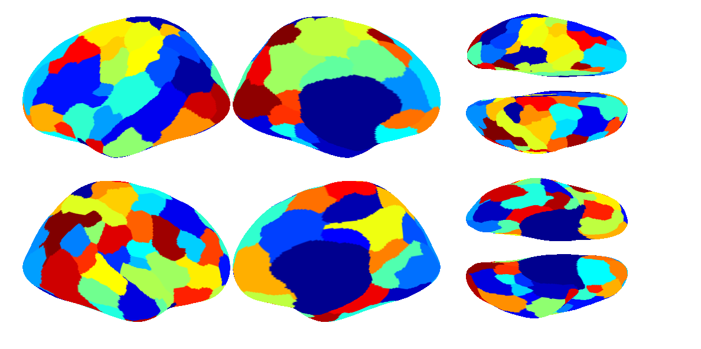

Here we provide an example for you to run so that you can have a brief sense about how our clustering code works.

----

References
==========
+ Schaefer A, Kong R, Gordon EM, Zuo XN, Holmes AJ, Eickhoff SB, Yeo BT, (accepted), Local-Global Parcellation of the Human Cerebral Cortex From Intrinsic Functional Connectivity MRI, Cerebral Cortex
+ Zuo, X.N., et al (2014), An open science resource for establishing reliability and reproducibility in functional connectomics, Sci data, 1:140049

----

Install
=======
**Set up your enviroment**

The configuration scripts `CBIG_gwMRF_tested_config.sh` and `CBIG_gwMRF_tested_startup.m` can be found under `<your-cbig-repo-direcotry>/stable_projects/brain_parcellation/Schaefer2018_LocalGlobal/config` folder. 

Please follow the instructions in `<your-cbig-repo-direcotry>/setup/README.md` to have your local environment compatible with CBIG repository. 

----

Example data
============
We use two subjects from the preprocessed Hangzhou Normal University (HNU) dataset as example data. The example data can be found here: `${CBIG_CODE_DIR}/data/example_data`.

----

Run example code
================
1) In terminal, run following command:

```
sh ${CBIG_CODE_DIR}/stable_projects/brain_parcellation/Schaefer2018_LocalGlobal/Code/examples/example_input/CBIG_gwMRF_create_example_input_fullpaths.sh <your_output_folder>
```
This will generate a file `example_input_fullpaths.csv` needed for the next step. The file will be stored in `<your_output_folder>`.


2) In MATLAB, `cd` to the `Code` folder containing the wrapper function

Enter for example: 

```
CBIG_gwMRF_build_data_and_perform_clustering('<your_output_folder>/example_input_fullpaths.csv','<your_output_folder>',1,2,50,50,5000,7,2,50000000,15);
```
This will call the wrapper function to create a solution with 50 left and 50 right hemisphere clusters in your output folder. 

There will be some warnings from the optimizer: "Warning: Neighbours array should be upper-triangular; entries below the diagnonal will be ignored." You can ignore them.

It may take 2-3 hours with 1 CPU for the example code to finish running. 

----

Example results
===============
After you finish running the code, there should be two `.mat` files in `<your_output_folder>/clustering` with names `*_seed_1.mat` and `*_seed_2.mat`.

These are the final clustering output files. You can compare your results with our results to see whether the codes work properly. Our results are provided in `./example_results`.

You can run the following commands in MATLAB command window to check seed 1:

```
my_seed = load('<your_output_folder>/clustering/*_seed_1.mat');
ref_seed = load('./example_results/clustering/*_seed_1.mat');

[lh_output, lh_assign, lh_cost, lh_dice_overlap] = CBIG_HungarianClusterMatch(my_seed.results.lh_label, ref_seed.results.lh_label, 1);
[rh_output, rh_assign, rh_cost, rh_dice_overlap] = CBIG_HungarianClusterMatch(my_seed.results.rh_label, ref_seed.results.rh_label, 1);

CBIG_DrawSurfaceMaps(my_seed.results.lh_label, my_seed.results.rh_label, 'fsaverage6', 'inflated')
```

If your results are exactly the same as ours, the message printed in the MATLAB command window should be:

```
Overlap = 37476, total_voxels 37476
Overlap = 37471, total_voxels 37471
```

You can also compare your figure of seed 1 with the following one:


For seed 2, you can follow the similar steps described above. 
Our figure for seed 2 is provided here:




Please note that the example clustering results may not look good since only two subjects are applied. The parameter settings are also simple to achieve shorter running time.

In our paper we use 1489 subjects' resting state fMRI data from the GSP dataset. Please refer to the paper and supplementary data for more information about the data and parameters we use.

----

Bugs and Questions
==================
Please contact Alexander Schaefer at alexschaefer83@gmail.com and Thomas Yeo at yeoyeo02@gmail.com.
