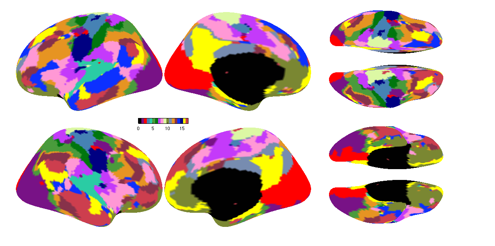

Sometimes we need to check whether any change to the repository has influence on the stable projects. Therefore, we provide the clustering results based on two subjects from Hangzhou Normal University (HNU) dataset. The purpose is to check whether the scripts can generate exactly the same results as you expected. This small example can also give you a brief sense about how to use the scripts. (The clustering results may not look good since it only uses two subjects.)

----

## Code

Run the following command with your own job-submitting script:

```
$CBIG_CODE_DIR/stable_projects/brain_parcellation/Yeo2011_fcMRI_clustering/examples/scripts/CBIG_Yeo2011_example.csh <your_own_output_dir>
```

We do not offer the command to submit jobs to the job scheduler because different users can have different types of job schedulers. The estimated walltime is less than 20min, and the estimated mem usage is less than 2G.

----

## Results

If you have run the command above, there should be a `.mat` file: `<your_own_output_dir>/clustering/HNU_example_clusters017_scrub.mat`. This is the final clustering output file.

Run the following commands in Matlab command window:

```
clustered = load('<Your clustering .mat file>');
ref_file = [<Your CBIG_CODE_DIR> '/stable_projects/brain_parcellation/Yeo2011_fcMRI_clustering/1000subjects_reference/1000subjects_clusters017_ref.mat'];
ref = load(ref_file);
CBIG_DrawSurfaceMaps(clustered.lh_labels, clustered.rh_labels, 'fsaverage5','inflated',0, 17, ref.colors)
```

Compare your figure with the following one:



Check whether they are exactly the same as you expected.
